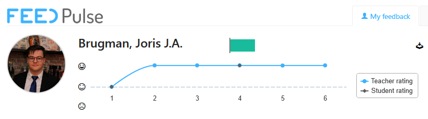
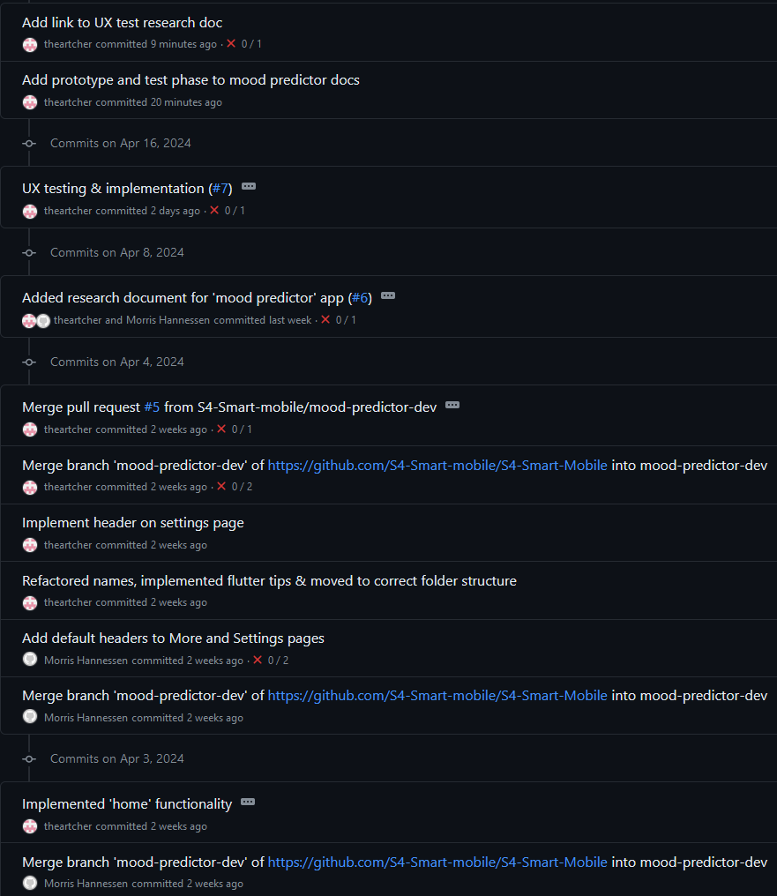

# Semester 4 - Smart mobile

_By [Joris Brugman](https://github.com/theartcher)_

  

## Overview

- [Semester 4 - Smart mobile](#semester-4---smart-mobile)
  - [Overview](#overview)
  - [Introduction](#introduction)
  - [Organizations, repositories \& other interesting references](#organizations-repositories--other-interesting-references)
    - [Connections](#connections)
      - [Learning outcomes](#learning-outcomes)
  - [Recent changes](#recent-changes)
    - [Week 4 - 9](#week-4---9)
      - [How's FeedPulse looking? Well I'm glad you asked](#hows-feedpulse-looking-well-im-glad-you-asked)
      - [What's changed since last time?](#whats-changed-since-last-time)
  - [History](#history)
    - [Week 1 - 3](#week-1---3)
      - [How's FeedPulse looking? Well I'm glad you asked](#hows-feedpulse-looking-well-im-glad-you-asked-1)
      - [What's changing for next time?](#whats-changing-for-next-time)

## Introduction

This document serves as the handlebars for finding your way around this _~~mess~~_ portfolio. All the code and/or documentation produced here is made to provide evidence to pass Fontys ICT 'Smart mobile' semester 4.

Take your time to look through this document, **or [skip to the changes since last time](#recent-changes).**

## Organizations, repositories & other interesting references

### Connections

- Duo case

  - [S4 - Github organization](https://github.com/S4-Smart-mobile/)
  - [Duo cases - Github repository](https://github.com/S4-Smart-mobile/S4-Smart-Mobile)
  - ['Cultural exchange' research/documentation](https://github.com/S4-Smart-mobile/S4-Smart-Mobile/blob/main/documentation/research/cultural-exchange.md)
  - ['Mood predictor' research/documentation](https://github.com/S4-Smart-mobile/S4-Smart-Mobile/blob/main/documentation/research/mood-predictor.md)

- Individual cases
  - ['Microphone Mixer' - Mini-technical overview](./documentation/microphone-mixer-technical-design.md)
  - ['Microphone Mixer' - Getting started](./microphone-mixer/README.MD)
  - ['Pew pew' - Getting started](./pew_pew_nfc/README.md)
  - [Portfolio (Individual cases) - Github repository](https://github.com/theartcher/S4-SM-Individual)

#### Learning outcomes

To get more specifics on what a specific learning outcome encompasses, take a look at each one here:

- [1. Analysis](./documentation/learning-outcomes/1-analysis.md)
- [2. Advice](./documentation/learning-outcomes/2-advice.md)
- [3. Design](./documentation/learning-outcomes/3-design.md)
- [4. Realisation](./documentation/learning-outcomes/4-realisation.md)
- [5. Management & control](./documentation/learning-outcomes/5-management-and-control.md)
- [6. Professional skills](./documentation/learning-outcomes/6-profesional-skills.md)

## Recent changes

An overview of all the changes made categorized per assignment period.

### Week 4 - 9

- Selected and created a new [tech case](./pew_pew_nfc/README.md).
- Did the following for the [duo case documentation](https://github.com/S4-Smart-mobile/S4-Smart-Mobile/blob/main/documentation/research/mood-predictor.md):
  - Created the [persona's](https://github.com/S4-Smart-mobile/S4-Smart-Mobile/blob/main/documentation/research/mood-predictor.md#personas).
  - Created & held the [first survey](https://github.com/S4-Smart-mobile/S4-Smart-Mobile/blob/main/documentation/interviews-surveys/mood-mental-health-survey.md), documented the findings.
  - Created [problem definitions](https://github.com/S4-Smart-mobile/S4-Smart-Mobile/blob/main/documentation/research/mood-predictor.md#define) to further research.
  - Researched problem definition [1](https://github.com/S4-Smart-mobile/S4-Smart-Mobile/blob/main/documentation/research/mood-predictor.md#1-what-data-visualization-methods-would-be-effective-in-helping-users-understand-mood-trendspatterns) and [2](https://github.com/S4-Smart-mobile/S4-Smart-Mobile/blob/main/documentation/research/mood-predictor.md#2-how-can-we-minimize-the-impact-on-user-daily-routines-yet-still-effectively-predict-moods).
  - Created & held the [2nd survey](https://github.com/S4-Smart-mobile/S4-Smart-Mobile/blob/main/documentation/interviews-surveys/mood-mental-health-survey-V2.md), documented the findings.
  - [Ideated with Morris](https://github.com/S4-Smart-mobile/S4-Smart-Mobile/blob/main/documentation/research/mood-predictor.md#ideate).
  - [Research competitor's apps](https://github.com/S4-Smart-mobile/S4-Smart-Mobile/blob/main/documentation/research/mood-predictor.md#competitor-apps).
  - Defined the [colour/font schema](https://github.com/S4-Smart-mobile/S4-Smart-Mobile/blob/main/documentation/research/mood-predictor.md#colour-palette) for the app.
  - Created the 'setup', 'survey' & 'home' page [designs](https://www.figma.com/file/jL4eFw7Sp32cZ8vMQ4LUv2/MoodTracker?type=design&node-id=0%3A1&mode=design&t=9rJcZkRzKcvTGmtp-1).
  - Implemented the [setup](https://github.com/S4-Smart-mobile/S4-Smart-Mobile/blob/main/mood_predictor_app/lib/pages/setup.dart), [survey](https://github.com/S4-Smart-mobile/S4-Smart-Mobile/blob/main/mood_predictor_app/lib/pages/questions.dart) & [home](https://github.com/S4-Smart-mobile/S4-Smart-Mobile/blob/main/mood_predictor_app/lib/pages/home.dart) page into the app (dynamic rendering but static content).
  - UX tested the alternative 'home' pages [designs](https://www.figma.com/file/jL4eFw7Sp32cZ8vMQ4LUv2/MoodTracker?type=design&node-id=0%3A1&mode=design&t=9rJcZkRzKcvTGmtp-1).
  - Created the [video/advert](https://www.youtube.com/watch?v=W6JgpJtueeA).
- Systematically helped/worked with [Chantal Maas](https://www.linkedin.com/in/chantal-maas-605aa22a4/) with various API/technical issues. She in turn helped me with UX/UI.

#### How's FeedPulse looking? Well I'm glad you asked

#### What's changed since last time?

- Morris has helped significantly more in the duo case in regard to documentation, coding and designing.
- I've consistently been receiving weekly feedback from Erik.
- Commit messaging are actually meaningful nowadays.
  
- Ended up not involving JIRA more, as we saw it was not necessary due to our communication in it's current state already being sufficient for the complexity of the project.
- Design thinking was implemented much more and very useful as a structure to hold onto.

## History

An overview of the old changes made. Not interesting if you are an assessor.

### Week 1 - 3

- Created this portfolio.
- Got a basic information infrastructure working, the duo project has a corresponding [Github organization](https://github.com/S4-Smart-mobile/) and a [JIRA board](/static/images/Jira-screenshot-21-02-2024.png).
- Created the research document in regard to the [duo app 'Cultural Exchange'](https://github.com/S4-Smart-mobile/S4-Smart-Mobile/blob/main/documentation/research/cultural-exchange.md).

  - Created the [design](https://www.figma.com/file/lehYegLvaF8PYE0Y9X5rNB/Cultural-Exchange?type=design&node-id=0%3A1&mode=design&t=UvwBHFVfqxP3820K-1) for the duo case.
  - Created the [poster](https://www.figma.com/file/wQYRmiwEKuVhwoQeEhjFzZ/Cultural-exchange---Posters?type=design&node-id=0%3A1&mode=design&t=3BUz67FEdluEC0gd-1) for the duo case.

- Did some mini-research for the individual project's [tech case 24 'Microphone Mixer'](/documentation/microphone-mixer-technical-design.md). _(The document displays the technical side of the case.)_

#### How's FeedPulse looking? Well I'm glad you asked

#### What's changing for next time?

- Get actual FeedPulse checkpoints with Erik. _(I asked, received and documented feedback but not inside of FeedPulse.)_
- Useful commit messaging, even in the personal projects. No more of

- Asking Morris to help more in the duo case's design and/or documentation.
- Actually using the JIRA created for the duo case.
- Implement the 'design thinking' framework better into the entire process.

Though these improvements seem like a big bunch, it's mostly minor QoL (quality of life) changes. **I still think I had a good start and hope to keep this spirit during the semester.**
