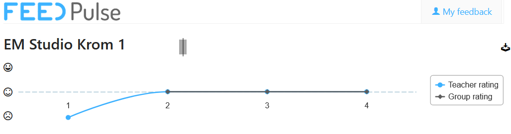
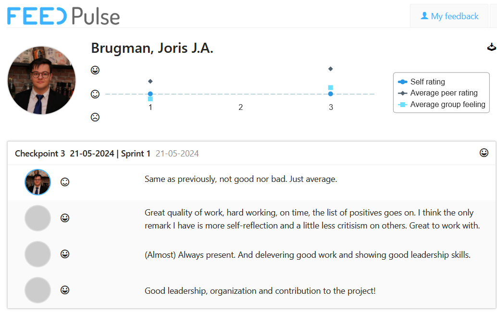
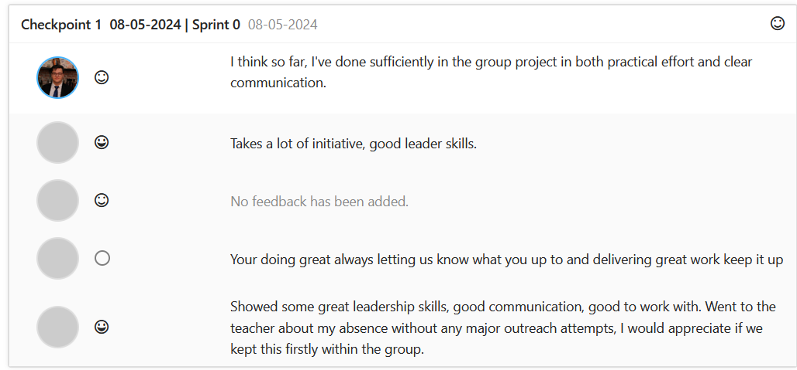

# Semester 4 - Smart mobile

_By [Joris Brugman](https://github.com/theartcher)_

  

## Overview

- [Semester 4 - Smart mobile](#semester-4---smart-mobile)
  - [Overview](#overview)
  - [Introduction](#introduction)
  - [Organizations, repositories \& other interesting references](#organizations-repositories--other-interesting-references)
    - [Connections](#connections)
      - [Learning outcomes](#learning-outcomes)
  - [Recent changes](#recent-changes)
    - [Week 10 - 14](#week-10---14)
      - [How's FeedPulse looking? Well I'm glad you asked](#hows-feedpulse-looking-well-im-glad-you-asked)
  - [History](#history)
    - [Week 4 - 9](#week-4---9)
      - [How's FeedPulse looking? Well I'm glad you asked](#hows-feedpulse-looking-well-im-glad-you-asked-1)
      - [What's changed since last time?](#whats-changed-since-last-time)
    - [Week 1 - 3](#week-1---3)
      - [How's FeedPulse looking? Well I'm glad you asked](#hows-feedpulse-looking-well-im-glad-you-asked-2)
      - [What's changing for next time?](#whats-changing-for-next-time)

## Introduction

This document serves as the handlebars for finding your way around this _~~mess~~_ portfolio. All the code and/or documentation produced here is made to provide evidence to pass Fontys ICT 'Smart mobile' semester 4.

Take your time to look through this document, **or [skip to the changes since last time](#recent-changes).**

## Organizations, repositories & other interesting references

### Connections

- Duo case

  - [S4 - Github organization](https://github.com/S4-Smart-mobile/)
  - [Duo cases - Github repository](https://github.com/S4-Smart-mobile/S4-Smart-Mobile)
  - ['Cultural exchange' research/documentation](https://github.com/S4-Smart-mobile/S4-Smart-Mobile/blob/main/documentation/research/cultural-exchange.md)
  - ['Mood predictor' research/documentation](https://github.com/S4-Smart-mobile/S4-Smart-Mobile/blob/main/documentation/research/mood-predictor.md)

- Individual cases
  - ['Microphone Mixer' - Mini-technical overview](./documentation/microphone-mixer-technical-design.md)
  - ['Microphone Mixer' - Getting started](./microphone-mixer/README.MD)
  - ['Pew pew' - Getting started](./pew_pew_nfc/README.md)
  - [Portfolio (Individual cases) - Github repository](https://github.com/theartcher/S4-SM-Individual)

#### Learning outcomes

To get more specifics on what a specific learning outcome encompasses, take a look at each one here:

- [1. Analysis](./documentation/learning-outcomes/1-analysis.md)
- [2. Advice](./documentation/learning-outcomes/2-advice.md)
- [3. Design](./documentation/learning-outcomes/3-design.md)
- [4. Realisation](./documentation/learning-outcomes/4-realisation.md)
- [5. Management & control](./documentation/learning-outcomes/5-management-and-control.md)
- [6. Professional skills](./documentation/learning-outcomes/6-profesional-skills.md)

## Recent changes

An overview of all the changes made categorized per assignment period.

### Week 10 - 14

- Worked on the [internship project proposal](https://stichtingfontys-my.sharepoint.com/:w:/g/personal/504943_student_fontys_nl/ETI10_batgpBmRtuV6-sKB0Bxsxdny2amfay4lCMM9CIsQ?email=sven%40aigro.nl&e=j1tEr2).
- Worked as SCRUM master for the group project.
- Set up the [Github organization](https://github.com/StudioKrom-SmartMobile-2024).
- Set up the [Github repository](https://github.com/StudioKrom-SmartMobile-2024/frontend).
- Set up the [JIRA](https://io-dev.atlassian.net/jira/software/projects/IPSM4/boards/5).
- [Sprint 0](https://www.notion.so/Sprint-0-2f13d54732414a1b804a1bbac14945ff)
  - Conducted [research](https://www.notion.so/Sprint-0-2f13d54732414a1b804a1bbac14945ff) into overstimulation.
  - Rewrote, specified and compacted found research elements.
  - Helped the team create the [persona](https://www.figma.com/file/Z4ujWZEm278iproVnWCyIs/Untitled?type=design&mode=design&t=8jt6D2XNAnusgjW5-1)'s, [target audience](https://www.notion.so/Sprint-0-2f13d54732414a1b804a1bbac14945ff?pvs=4#81014fed2fde4bfc880ee83477471a7c) & brainstorm.
  - Prepared the backlog & planning for sprint 1.
  - Organized SCRUM poker for the team.
- [Sprint 1](https://www.notion.so/Sprint-I-69351973c8ee4d4fbd3dd8d1b2623718)
  - Conducted & formulated [technical research](https://www.notion.so/Technical-Research-Demos-481ede4b614c4195874ad1d97018eb30).
  - Helped [Morris](https://www.linkedin.com/in/morris-h-876801276/) reformat his research to be more readable.
  - Created [demo's](https://github.com/StudioKrom-SmartMobile-2024/frontend/tree/main/demos) to accompany the conclusions from the technical research.
  - Prepared the backlog & planning for sprint 2.
  - Created the [Q&A questions](https://www.notion.so/Psychologist-Q-A-ff21d65d5c0b417b91a7752de3085b18) for the psychologist.
  - Reviewed (and where necessary-) rewrote the concept document.
- [Sprint 2](https://www.notion.so/Sprint-II-e03a5e1d62f643f5a0faa3434564b9b3)
  - Gathered a VR camera & [footage](https://stichtingfontys-my.sharepoint.com/:v:/g/personal/504943_student_fontys_nl/EWpCtFcGQHNJuWTiuw2KcWABN7YC9z-K_JSar5FWJJeY8Q?nav=eyJyZWZlcnJhbEluZm8iOnsicmVmZXJyYWxBcHAiOiJPbmVEcml2ZUZvckJ1c2luZXNzIiwicmVmZXJyYWxBcHBQbGF0Zm9ybSI6IldlYiIsInJlZmVycmFsTW9kZSI6InZpZXciLCJyZWZlcnJhbFZpZXciOiJNeUZpbGVzTGlua0NvcHkifX0&e=AiEjX8)
  - Documented the [360 footage/scenarios](https://www.notion.so/360-VR-Footage-885520eeb5b340cc8a4b0c067af8b309)
  - Did a lot of research into ambisonic sound editing/configuration, sadly I was unable to get far.
  - Implemented the design of the [VR-player](https://github.com/StudioKrom-SmartMobile-2024/frontend/blob/main/demos/vr_demo/lib/pages/VideoPlayer.dart)
    - Wrapped the [SoundManager](https://github.com/StudioKrom-SmartMobile-2024/frontend/blob/main/demos/vr_demo/lib/utils/SoundManager.dart) into an abstract class and extended using [TrainScenarioManager](https://github.com/StudioKrom-SmartMobile-2024/frontend/blob/main/demos/vr_demo/lib/utils/SoundManager.dart#L57)
    - Added autoplay
    - Added disclaimers/[confirmation dialogues](https://github.com/StudioKrom-SmartMobile-2024/frontend/blob/main/demos/vr_demo/lib/widgets/vr-dialogues/ConfirmationDialogue.dart) (includes pausing when showing and handling gestures outside of the dialogue)
    - Added [settings](https://github.com/StudioKrom-SmartMobile-2024/frontend/blob/main/demos/vr_demo/lib/widgets/vr-dialogues/SettingsOverlay.dart)
  - Debugged TomTom routing/area avoid API with [Chantal Maas](https://www.linkedin.com/in/chantal-maas-605aa22a4/).
  - Implemented the [Overload design](https://www.figma.com/design/vjSt02gUbVpAXFiB0JzmIz/Overload-App-Design) into the app
    - Updated the [gradient button](https://github.com/StudioKrom-SmartMobile-2024/frontend/blob/main/overload/lib/widgets/gradient_button.dart) widget to be more re-useable
    - Introduced [constants](https://github.com/StudioKrom-SmartMobile-2024/frontend/blob/main/overload/lib/constants.dart) as to make development and maintenance easier
    - [Update 'welcome' page](https://github.com/StudioKrom-SmartMobile-2024/frontend/blob/main/overload/lib/pages/welcome.dart) to be more readable and not overflow
    - [Update 'home' page](https://github.com/StudioKrom-SmartMobile-2024/frontend/blob/main/overload/lib/pages/home.dart) to be more readable and less prone to flex errors
    - [Update 'experience cards'](https://github.com/StudioKrom-SmartMobile-2024/frontend/blob/main/overload/lib/widgets/experience_cards.dart) to better work with the icons and remove redundant/error prone code.
    - Created an [animation](https://github.com/StudioKrom-SmartMobile-2024/frontend/blob/main/overload/lib/widgets/OverstimulateIntroAnimation.dart) on the welcome page using the [marquee effect](https://github.com/StudioKrom-SmartMobile-2024/frontend/blob/main/overload/lib/widgets/MarqueeEffect.dart). (**IMPORTANT NOTE: The MarqueeEffect.dart was only updated by me, the original code is credited in the code.**)

#### How's FeedPulse looking? Well I'm glad you asked

## History

An overview of the old changes made. Not interesting if you are an assessor.

### Week 4 - 9

- Selected and created a new [tech case](./pew_pew_nfc/README.md).
- Did the following for the [duo case documentation](https://github.com/S4-Smart-mobile/S4-Smart-Mobile/blob/main/documentation/research/mood-predictor.md):
  - Created the [persona's](https://github.com/S4-Smart-mobile/S4-Smart-Mobile/blob/main/documentation/research/mood-predictor.md#personas).
  - Created & held the [first survey](https://github.com/S4-Smart-mobile/S4-Smart-Mobile/blob/main/documentation/interviews-surveys/mood-mental-health-survey.md), documented the findings.
  - Created [problem definitions](https://github.com/S4-Smart-mobile/S4-Smart-Mobile/blob/main/documentation/research/mood-predictor.md#define) to further research.
  - Researched problem definition [1](https://github.com/S4-Smart-mobile/S4-Smart-Mobile/blob/main/documentation/research/mood-predictor.md#1-what-data-visualization-methods-would-be-effective-in-helping-users-understand-mood-trendspatterns) and [2](https://github.com/S4-Smart-mobile/S4-Smart-Mobile/blob/main/documentation/research/mood-predictor.md#2-how-can-we-minimize-the-impact-on-user-daily-routines-yet-still-effectively-predict-moods).
  - Created & held the [2nd survey](https://github.com/S4-Smart-mobile/S4-Smart-Mobile/blob/main/documentation/interviews-surveys/mood-mental-health-survey-V2.md), documented the findings.
  - [Ideated with Morris](https://github.com/S4-Smart-mobile/S4-Smart-Mobile/blob/main/documentation/research/mood-predictor.md#ideate).
  - [Research competitor's apps](https://github.com/S4-Smart-mobile/S4-Smart-Mobile/blob/main/documentation/research/mood-predictor.md#competitor-apps).
  - Defined the [colour/font schema](https://github.com/S4-Smart-mobile/S4-Smart-Mobile/blob/main/documentation/research/mood-predictor.md#colour-palette) for the app.
  - Created the 'setup', 'survey' & 'home' page [designs](https://www.figma.com/file/jL4eFw7Sp32cZ8vMQ4LUv2/MoodTracker?type=design&node-id=0%3A1&mode=design&t=9rJcZkRzKcvTGmtp-1).
  - Implemented the [setup](https://github.com/S4-Smart-mobile/S4-Smart-Mobile/blob/main/mood_predictor_app/lib/pages/setup.dart), [survey](https://github.com/S4-Smart-mobile/S4-Smart-Mobile/blob/main/mood_predictor_app/lib/pages/questions.dart) & [home](https://github.com/S4-Smart-mobile/S4-Smart-Mobile/blob/main/mood_predictor_app/lib/pages/home.dart) page into the app (dynamic rendering but static content).
  - UX tested the alternative 'home' pages [designs](https://www.figma.com/file/jL4eFw7Sp32cZ8vMQ4LUv2/MoodTracker?type=design&node-id=0%3A1&mode=design&t=9rJcZkRzKcvTGmtp-1).
  - Created the [video/advert](https://www.youtube.com/watch?v=W6JgpJtueeA).
- Systematically helped/worked with [Chantal Maas](https://www.linkedin.com/in/chantal-maas-605aa22a4/) with various API/technical issues. She in turn helped me with UX/UI.

#### How's FeedPulse looking? Well I'm glad you asked

#### What's changed since last time?

- Morris has helped significantly more in the duo case in regard to documentation, coding and designing.
- I've consistently been receiving weekly feedback from Erik.
- Commit messaging are actually meaningful nowadays.
  
- Ended up not involving JIRA more, as we saw it was not necessary due to our communication in it's current state already being sufficient for the complexity of the project.
- Design thinking was implemented much more and very useful as a structure to hold onto.

### Week 1 - 3

- Created this portfolio.
- Got a basic information infrastructure working, the duo project has a corresponding [Github organization](https://github.com/S4-Smart-mobile/) and a [JIRA board](/static/images/Jira-screenshot-21-02-2024.png).
- Created the research document in regard to the [duo app 'Cultural Exchange'](https://github.com/S4-Smart-mobile/S4-Smart-Mobile/blob/main/documentation/research/cultural-exchange.md).

  - Created the [design](https://www.figma.com/file/lehYegLvaF8PYE0Y9X5rNB/Cultural-Exchange?type=design&node-id=0%3A1&mode=design&t=UvwBHFVfqxP3820K-1) for the duo case.
  - Created the [poster](https://www.figma.com/file/wQYRmiwEKuVhwoQeEhjFzZ/Cultural-exchange---Posters?type=design&node-id=0%3A1&mode=design&t=3BUz67FEdluEC0gd-1) for the duo case.

- Did some mini-research for the individual project's [tech case 24 'Microphone Mixer'](/documentation/microphone-mixer-technical-design.md). _(The document displays the technical side of the case.)_

#### How's FeedPulse looking? Well I'm glad you asked

#### What's changing for next time?

- Get actual FeedPulse checkpoints with Erik. _(I asked, received and documented feedback but not inside of FeedPulse.)_
- Useful commit messaging, even in the personal projects. No more of

- Asking Morris to help more in the duo case's design and/or documentation.
- Actually using the JIRA created for the duo case.
- Implement the 'design thinking' framework better into the entire process.

Though these improvements seem like a big bunch, it's mostly minor QoL (quality of life) changes. **I still think I had a good start and hope to keep this spirit during the semester.**
