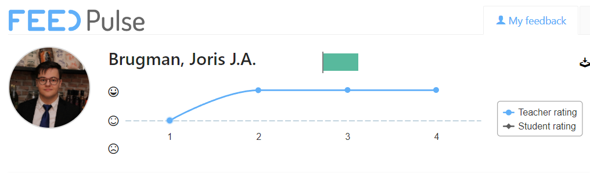

# Semester 4 - Smart mobile

_By [Joris Brugman](https://github.com/theartcher)_

## Overview

- [Semester 4 - Smart mobile](#semester-4---smart-mobile)
  - [Overview](#overview)
  - [Introduction](#introduction)
  - [Organizations, repositories \& other interesting references](#organizations-repositories--other-interesting-references)
    - [Research documents](#research-documents)
      - [Learning outcomes](#learning-outcomes)
  - [Recent changes](#recent-changes)
    - [Week 1 - 3](#week-1---3)

## Introduction

This document serves as the handlebars for finding your way around this _~~mess~~_ portfolio. All the code and/or documentation produced here is made to provide evidence to pass Fontys ICT 'Smart mobile' semester 4.

Take your time to look through this document, **or [skip to the changes since last time](#recent-changes).**

## Organizations, repositories & other interesting references

I've done nothing interesting so far :(

### Research documents

- [Mini-technical research - Microphone Mixer](./documentation/microphone-mixer-technical-design.md)

#### Learning outcomes

To get more specifics on what a specific learning outcome encompasses, take a look at each one here:

- [1. Analysis](./documentation/learning-outcomes/1-analysis.md)
- [2. Advice](./documentation/learning-outcomes/2-advice.md)
- [3. Design](./documentation/learning-outcomes/3-design.md)
- [4. Realisation](./documentation/learning-outcomes/4-realisation.md)
- [5. Management & control](./documentation/learning-outcomes/5-management-and-control.md)
- [6. Professional skills](./documentation/learning-outcomes/6-profesional-skills.md)

## Recent changes

### Week 1 - 3

- Created this portfolio.
- Got a basic information infrastructure working, the duo project has a corresponding [Github organization](https://github.com/S4-Smart-mobile/) and a [JIRA board](/static/images/Jira-screenshot-21-02-2024.png).
- Started work on the research document in regard to the [DUO app](https://github.com/S4-Smart-mobile/S4-Smart-Mobile/blob/main/documentation/research/cultural-exchange-research.md).
- Did some mini-research for the individual project's [tech case 24 'Microphone Mixer'](/documentation/microphone-mixer-technical-design.md). (The document displays the technical side of the case.)

How's FeedPulse looking? Well I'm glad you asked:

