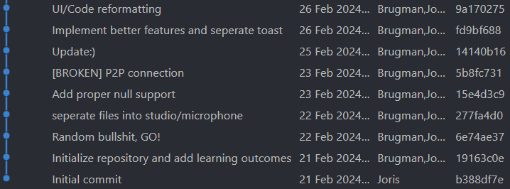

# Semester 4 - Smart mobile

_By [Joris Brugman](https://github.com/theartcher)_

  

## Overview

- [Semester 4 - Smart mobile](#semester-4---smart-mobile)
  - [Overview](#overview)
  - [Introduction](#introduction)
  - [Organizations, repositories \& other interesting references](#organizations-repositories--other-interesting-references)
    - [Documents](#documents)
      - [Learning outcomes](#learning-outcomes)
  - [Recent changes](#recent-changes)
    - [Week 1 - 3](#week-1---3)
      - [What's changing for next time?](#whats-changing-for-next-time)

## Introduction

This document serves as the handlebars for finding your way around this _~~mess~~_ portfolio. All the code and/or documentation produced here is made to provide evidence to pass Fontys ICT 'Smart mobile' semester 4.

Take your time to look through this document, **or [skip to the changes since last time](#recent-changes).**

## Organizations, repositories & other interesting references

### Documents

- Duo case

  - [Case research/documentation](https://github.com/S4-Smart-mobile/S4-Smart-Mobile/blob/main/documentation/research/cultural-exchange.md)
  - ['Cultural exchange' - Github organization](https://github.com/S4-Smart-mobile/)
  - ['Cultural exchange' - Github repository](https://github.com/S4-Smart-mobile/S4-Smart-Mobile)

- Individual cases
  - ['Microphone Mixer' - Mini-technical overview](./documentation/microphone-mixer-technical-design.md)
  - ['Microphone Mixer' - Github repository](https://github.com/theartcher/S4-SM-Individual)

#### Learning outcomes

To get more specifics on what a specific learning outcome encompasses, take a look at each one here:

- [1. Analysis](./documentation/learning-outcomes/1-analysis.md)
- [2. Advice](./documentation/learning-outcomes/2-advice.md)
- [3. Design](./documentation/learning-outcomes/3-design.md)
- [4. Realisation](./documentation/learning-outcomes/4-realisation.md)
- [5. Management & control](./documentation/learning-outcomes/5-management-and-control.md)
- [6. Professional skills](./documentation/learning-outcomes/6-profesional-skills.md)

## Recent changes

### Week 1 - 3

- Created this portfolio.
- Got a basic information infrastructure working, the duo project has a corresponding [Github organization](https://github.com/S4-Smart-mobile/) and a [JIRA board](/static/images/Jira-screenshot-21-02-2024.png).
- Created the research document in regard to the [duo app 'Cultural Exchange'](https://github.com/S4-Smart-mobile/S4-Smart-Mobile/blob/main/documentation/research/cultural-exchange.md).

  - Created the [design](https://www.figma.com/file/lehYegLvaF8PYE0Y9X5rNB/Cultural-Exchange?type=design&node-id=0%3A1&mode=design&t=UvwBHFVfqxP3820K-1) for the duo case.
  - Created the [poster](https://www.figma.com/file/wQYRmiwEKuVhwoQeEhjFzZ/Cultural-exchange---Posters?type=design&node-id=0%3A1&mode=design&t=3BUz67FEdluEC0gd-1) for the duo case.

- Did some mini-research for the individual project's [tech case 24 'Microphone Mixer'](/documentation/microphone-mixer-technical-design.md). _(The document displays the technical side of the case.)_

How's FeedPulse looking? Well I'm glad you asked:

#### What's changing for next time?

- Get actual FeedPulse checkpoints with Erik. _(I asked, received and documented feedback but not inside of FeedPulse.)_
- Useful commit messaging, even in the personal projects. No more of

- Asking Morris to help more in the duo case's design and/or documentation.
- Actually using the JIRA created for the duo case.
- Implement the 'design thinking' framework better into the entire process.

Though these improvements seem like a big bunch, it's mostly minor QoL (quality of life) changes. **I still think I had a good start and hope to keep this spirit during the semester.**
