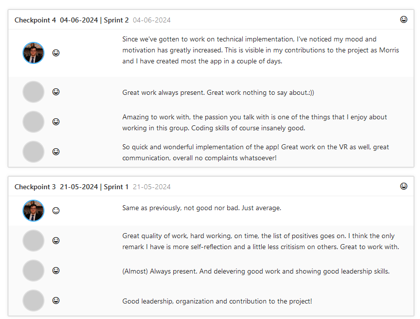
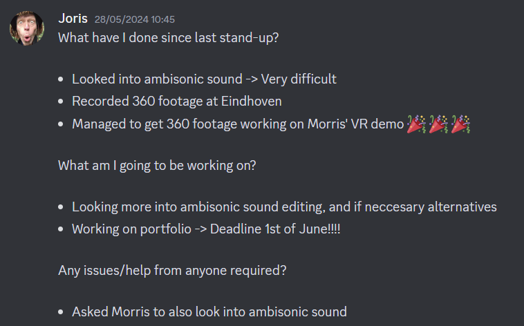
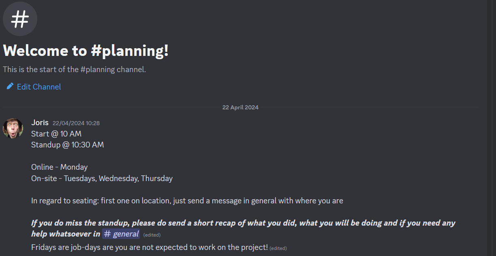
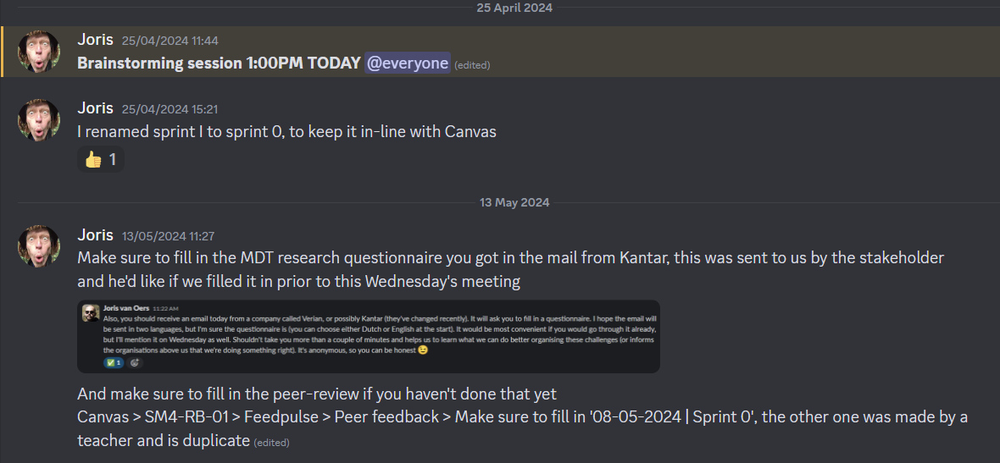

# Management & control

_Take me back to the [home](../../README.md)_

- [Management \& control](#management--control)
  - [Description](#description)
    - [Learning outcome](#learning-outcome)
    - [Clarification](#clarification)
  - [Implementation](#implementation)

## Description

  

### Learning outcome

> You continuously apply techniques to manage a development process and to assure its quality in direct communication with all stakeholders .

### Clarification

Stakeholders are all clients, (future) developers, all users. You process the feedback given in your work.

## Implementation

In the group project I took a more team-lead role upon myself, I tried to make sure the stakeholders were informed and up to date on any changes, next to that I motivated the group to finish tasks, fill in peer reviews, I helped them participate in the retrospectives & made sure the sprints' tasks are scoped properly and done on time. Next to that I reminded them for any major events with the POs such as sprint reviews, demonstrations & external speakers. This role was perceived quite well throughout the group as visible in the FeedPulse peer-reviews.

To aid this quest of communication I proactively let the team know how I was spending my time throughout the day using standups and the [JIRA board](https://io-dev.atlassian.net/jira/software/projects/IPSM4/boards/5).

In the discord server we had a channel called '#planning' for all default guidelines regarding availability. We made arrangements for certain working hours as aligned in our Discord server.

I always tried to inform our group using the '#announcements' channel.

I get the stakeholders up to date on changes and expectations in regard to the group project using both email and Slack, next to the default meetings on Tuesday, in which I was (with a single exception) always present to receive them.
